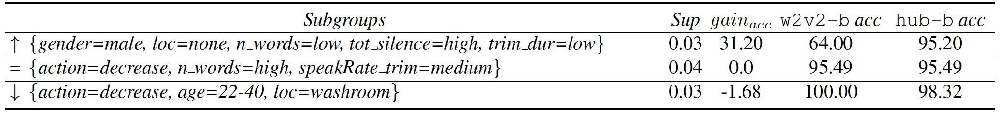

# Exploring Subgroup Performance in End-to-End Speech Models

[](https://ieeexplore.ieee.org/abstract/document/10095284)

Code associated with the paper [**"Exploring Subgroup Performance in End-to-End Speech Models"**](https://ieeexplore.ieee.org/abstract/document/10095284), accepted at ICASSP 2023.

In this repository, you will find the code to replicate our experiments.  
We do not include the dataset used in the paper as it is publicly available and downloadable from the [official site](https://fluent.ai/fluent-speech-commands-a-dataset-for-spoken-language-understanding-research/).

------------------ 

## Abstract
End-to-End Spoken Language Understanding models are generally evaluated according to their overall accuracy, or separately on (a priori defined) data subgroups of interest. 
We propose a technique for analyzing model performance at the subgroup level, which considers all subgroups that can be defined via a given set of metadata and are above a specified minimum size. The metadata can represent user characteristics, recording conditions, and speech targets. Our technique is based on advances in model bias analysis, enabling efficient exploration of resulting subgroups. A fine-grained analysis reveals how model performance varies across subgroups, identifying modeling issues or bias towards specific subgroups. 
We compare the subgroup-level performance of models based on wav2vec 2.0 and HuBERT on the Fluent Speech Commands dataset. The experimental results illustrate how subgroup-level analysis reveals a finer and more complete picture of performance changes when models are replaced, automatically identifying the subgroups that most benefit or fail to benefit from the change.

------------------ 

## Get Started
Our code was tested on Python 3.10.4. To make it work, you will need:
- a working environment with the libraries listed in `requirements.txt`;
- a functioning `torch` installation in the same environment.

## Running the Experiments
Use the `ic_fsc.ipynb` notebook to run the inference of the selected models on the FSC dataset, and to extract demographic, signal- and dataset- related metadata, building a `.csv` file such as the ones in the `data_precomputed` folder.

To reproduce the paper's experiments, you can directly run the `divexplorer_analysis.ipynb` notebook, which leverages the files already computed in `data_precomputed`. 

------------------ 

## What you can do
You can investigate the sources of errors for a model (i.e., wav2vec 2.0 large), and highlight the subgroups with the highest negative (or positive) divergence, as shown here:


You can also investigate the gain in performance at the subgroup level when changing one model (i.e., wav2vec 2.0 base) with another one (i.e., HuBERT base). For example, the following table shows the subgroups that most benefit or fail to benefit when changing these two models:



But you can even retrieve the subgroups that most benefit (or fail to benefit) when scaling up the model size (i.e., wav2vec 2.0 base to large), as shown in this table: 


Finally, you can exploit the global Shapley values to investigate the impact of the items on the performance of the model. For example, the following image shows the top-15 items that have the highest impact on the performance when increasing the size of the wav2vec 2.0 model (orange) or when changing wav2vec 2.0 with HuBERT base (shaded blue):


## Citation
If you use this code in your research, please cite our paper:

```bibtex
@INPROCEEDINGS{koudounas2023,
  author={Koudounas, Alkis and Pastor, Eliana and Attanasio, Giuseppe and Mazzia, Vittorio and Giollo, Manuel and Gueudre, Thomas and Cagliero, Luca and de Alfaro, Luca and Baralis, Elena and Amberti, Daniele},
  booktitle={ICASSP 2023 - 2023 IEEE International Conference on Acoustics, Speech and Signal Processing (ICASSP)}, 
  title={Exploring Subgroup Performance in End-to-End Speech Models}, 
  year={2023},
  volume={},
  number={},
  pages={1-5},
  doi={10.1109/ICASSP49357.2023.10095284}}
```

## License
This code is released under the Apache 2.0 license. See the [LICENSE](LICENSE) file for more details.

## Contact
For any questions, please contact [Alkis Koudounas](mailto:alkis.koudounas@polito.it).
